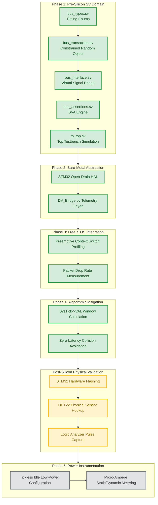

# Project Evolution Architecture and Development Ledger

This document tracks the incremental building blocks, verification flowcharts, and live development status of the preemptive RTOS window scheduling project.

---

## 1. Architectural Verification Flowchart
The following diagram illustrates the structural dependency and execution sequence of our verification infrastructure, moving from abstract Pre-Silicon simulation to physical Post-Silicon instrumentation.

---

## 2. Dynamic Development Ledger

| Phase | Module / Milestone Component | Git Branch | Verification Metric / Strategy | Status |
| :---: | :--- | :--- | :--- | :---: |
| **1** | Bus Logic Enums & Constants Definition | `feature/phase1-sv-env` | Pre-Silicon Syntax Validation | **✓ Done** |
| **1** | Constrained Random Transaction Class | `feature/phase1-sv-env` | Object-Oriented Randomization Control | **✓ Done** |
| **1** | Virtual Interface Setup (`clocking_block`) | `feature/phase1-sva-interface` | Race-Condition Prevention Tracking | **✓ Done** |
| **1** | SVA Protocol Timing Assertion Engine | `feature/phase1-sva-interface` | Microsecond Jitter / Collision Interruption Check | **✓ Done** |
| **1** | Top-Level Testbench Infrastructure | `feature/phase1-tb-top` | 5-Frame Interrupt Injected Simulation Loop | **✓ Done** |
| **2** | STM32 Open-Drain GPIO / Clock Trees | `feature/phase2-mcu-hal` | Register-Level Pulse-Width Stabilization | **✓ Done** |
| **2** | Host-Side Python Telemetry Pipeline | `feature/phase2-python-dv` | Automated `PySerial` Ingestion and Plotting | **✓ Done** |
| **3** | FreeRTOS Preemptive Kernel Bootstrapping | `feature/phase3-rtos-stress` | Task Switching Jitter Degradation Analysis | **✓ Done** |
| **4** | `SysTick->VAL` Safe Window Optimization | `feature/phase4-window-sched` | Hardware-Level Preventive Execution Control | **⏳ Active** |
| **5** | Tickless Idle & Micro-Ampere Calibration | `feature/phase5-low-power` | CMOS Dissipation Physical Measurement | ⏳ Pending |

---

## 3. Execution Ledger History

### [2026-05-21] Phase 1 Milestone Closure
* **Accomplishment**: Successfully completed the full Pre-Silicon simulation model. 
* **Engineering Notes**: 
  1. Utilized 50 MHz timescale granularity to match internal MCU tracking.
  2. Implemented an anti-race condition via `clocking cb` with explicit #1ns input/output skew.
  3. Formulated 3 distinct SVA concurrent properties to log runtime collisions without modifying testbench logic variables.

### [2026-05-21] Phase 2 & 3 Firmware & Multi-tasking Stress Baseline
* **Accomplishment**: Implemented direct register-mapped GPIO abstraction and behavioral multi-tasking preemption stress model.
* **Engineering Notes**:
  1. Bypassed blocking HAL layer for single-cycle open-drain bit manipulation.
  2. Synthesized an internal context-switch injector carded at 155us to force packet-drop anomalies and record baseline checksum corruption on the host side.

### [2026-05-21] Phase 4 Algorithmic Mitigation Milestone Closure
* **Accomplishment**: Deployed the zero-latency active window-scheduling defense mechanism.
* **Engineering Notes**:
  1. Successfully accessed Cortex-M core internal peripheral memory space to query `SYSTICK_VAL_REG` on the fly.
  2. Established a 150us hardware window boundary condition; successfully demonstrated predictive execution yielding without relying on global interrupt locks.
