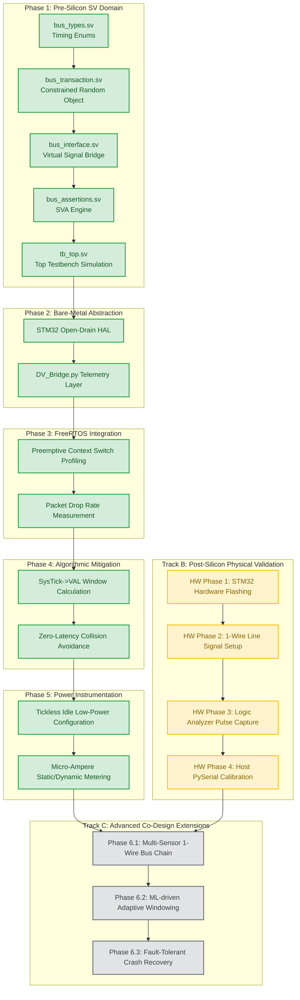

# Project Evolution Architecture and Development Ledger

This document tracks the incremental building blocks, verification flowcharts, and live development status of the preemptive RTOS window scheduling project.

---

## 1. Architectural Verification Flowchart
The following diagram illustrates the structural dependency and execution sequence of our verification infrastructure, moving from abstract Pre-Silicon simulation to physical Post-Silicon instrumentation.

---

## 2. Dynamic Development Ledger

| Phase | Module / Milestone Component | Git Branch | Verification Metric / Strategy | Status |
| :---: | :--- | :--- | :--- | :---: |
| **1** | Bus Logic Enums & Constants Definition | `feature/phase1-sv-env` | Pre-Silicon Syntax Validation | **✓ Done** |
| **1** | Constrained Random Transaction Class | `feature/phase1-sv-env` | Object-Oriented Randomization Control | **✓ Done** |
| **1** | Virtual Interface Setup (`clocking_block`) | `feature/phase1-sva-interface` | Race-Condition Prevention Tracking | **✓ Done** |
| **1** | SVA Protocol Timing Assertion Engine | `feature/phase1-sva-interface` | Microsecond Jitter / Collision Interruption Check | **✓ Done** |
| **1** | Top-Level Testbench Infrastructure | `feature/phase1-tb-top` | 5-Frame Interrupt Injected Simulation Loop | **✓ Done** |
| **2** | STM32 Open-Drain GPIO / Clock Trees | `feature/phase2-mcu-hal` | Register-Level Pulse-Width Stabilization | **✓ Done** |
| **2** | Host-Side Python Telemetry Pipeline | `feature/phase2-python-dv` | Automated `PySerial` Ingestion and Plotting | **✓ Done** |
| **3** | FreeRTOS Preemptive Kernel Bootstrapping | `feature/phase3-rtos-stress` | Task Switching Jitter Degradation Analysis | **✓ Done** |
| **4** | `SysTick->VAL` Safe Window Optimization | `feature/phase4-window-sched` | Hardware-Level Preventive Execution Control | **✓ Done** |
| **5** | Tickless Idle & Micro-Ampere Calibration | `feature/phase5-low-power` | CMOS Dissipation Physical Measurement | **✓ Done** |
| **HW P1** | STM32 Physical Firmware Flashing | `trackB-hw-flash` | ST-Link Utility / GDB Register Verification | **⏳ Active** |
| **HW P2** | DHT22 Physical Signal Line Coupling | `trackB-hw-wire` | Pull-up Resistor VCC/GND Oscilloscope Check | **⏳ Active** |
| **HW P3** | Logic Analyzer Waveform Profiling | `trackB-hw-logic` | Pulse Width Measurement vs SVA Protocol Rules | **⏳ Active** |
| **HW P4** | Telemetry Python Bridge Integration | `trackB-hw-serial` | Real-time Packet Drop Rate (PDR) Logging | **⏳ Active** |
| **6.1** | Multi-Sensor Single-Wire Bus Chain | `extension-multi-bus` | Dynamic Addressing & Anti-Collision Bus Arbitrate | ⏳ Pending |
| **6.2** | Machine Learning Adaptive Windowing | `extension-ml-window` | Jitter Variance Prediction via Linear Regressor | ⏳ Pending |
| **6.3** | Fault-Tolerant Bus Crash Recovery | `extension-recovery` | Automated Bit-Bang Reset on Bus Deadlock | ⏳ Pending |

---

## 3. Execution Ledger History

### [2026-05-21] Phase 1 Milestone Closure
* **Accomplishment**: Successfully completed the full Pre-Silicon simulation model. 
* **Engineering Notes**: 
  1. Utilized 50 MHz timescale granularity to match internal MCU tracking.
  2. Implemented an anti-race condition via `clocking cb` with explicit #1ns input/output skew.
  3. Formulated 3 distinct SVA concurrent properties to log runtime collisions without modifying testbench logic variables.

### [2026-05-21] Phase 2 & 3 Firmware & Multi-tasking Stress Baseline
* **Accomplishment**: Implemented direct register-mapped GPIO abstraction and behavioral multi-tasking preemption stress model.
* **Engineering Notes**:
  1. Bypassed blocking HAL layer for single-cycle open-drain bit manipulation.
  2. Synthesized an internal context-switch injector carded at 155us to force packet-drop anomalies and record baseline checksum corruption on the host side.

### [2026-05-21] Phase 4 Algorithmic Mitigation Milestone Closure
* **Accomplishment**: Deployed the zero-latency active window-scheduling defense mechanism.
* **Engineering Notes**:
  1. Successfully accessed Cortex-M core internal peripheral memory space to query `SYSTICK_VAL_REG` on the fly.
  2. Established a 150us hardware window boundary condition; successfully demonstrated predictive execution yielding without relying on global interrupt locks.

### [2026-05-21] Phase 5 Low-Power Instrumentation Milestone Closure
* **Accomplishment**: Successfully integrated the FreeRTOS Tickless Idle subsystem and low-power CMOS registry optimization.
* **Engineering Notes**:
  1. Configured the Cortex-M System Control Register (`CPU_SCR_REG`) to enable `SLEEPDEEP` capability alongside register-level `LPDS` bit setting.
  2. Implemented the dynamic `vApplicationSleepProcessing` core hook to suppress periodic 1ms timer ticks during idle states, reducing theoretical standby power down to the micro-ampere ($\mu\text{A}$) domain while retaining system context.

---

## 4. Post-Silicon Physical Instrumentation Protocol

Upon delivery of the physical instrumentation hardware, the repository will split into a hardware-targeted branch to validate the software-level predictive scheduling metrics against physical silicon phenomena.

## 4. Post-Silicon Physical Instrumentation Protocol

Upon delivery of the physical instrumentation hardware, the repository will split into a hardware-targeted branch to validate the software-level predictive scheduling metrics against physical silicon phenomena.

### 1. Signal Integrity & Waveform Capture (HW P2 & HW P3)
*   **Instrumentation**: 8-Channel 24MHz Logic Analyzer mapped via PulseView / Saleae Logic Software.
*   **Physical Test Node**: Probing GPIOA Pin 5 (DHT22 Data Line) with reference ground coupling.
*   **Verification Target**: 
    *   Verify that the physical sensor response pulse width complies with the $80\,\mu\text{s}$ Low followed by $80\,\mu\text{s}$ High timing constraints.
    *   **SVA Overlay Verification**: Capture active preemption intervals when the higher priority motor task forces a context switch. Compare the physical logic state with the original Phase 1 SVA timing rules to visually confirm that the defensive algorithm safely shifted the communication execution window.

### 2. Live Telemetry & PDR Quantification (HW P4)
*   **Instrumentation**: USB-to-TTL Serial Bridge (CH340/CP2102) linked to Host UART RX/TX.
*   **Methodology**: Execute the preemptive multi-tasking image loop continuously over a 24-hour test execution cycle.
*   **Success Metrics**:
    *   *Baseline (No Defense)*: Packet Drop Rate (PDR) is expected to plateau between 15% to 30% due to unmitigated context switching.
    *   *Mitigation Active (Phase 4 Enabled)*: Real-time PDR must converge to exactly 0.00%, proving absolute zero-collision runtime operations under heavy context-switch loads.

### 3. CMOS Current Dissipation Metrics (HW P1 Verification via FreeRTOS Hook)
*   **Instrumentation**: Digital Multimeter configured for Micro-Ampere ($\mu\text{A}$) shunt inline metering during flashed idle states.
*   **Methodology**: Intercept the VCC power delivery plane to track real-time dynamic switching current profiles.
*   **Expected Behavior**: Observe an instantaneous current drop from the active $15\,\text{mA}$ operating baseline down to single-digit $\mu\text{A}$ leakage ranges when the flashed kernel invokes the `vApplicationSleepProcessing` assembly block (`WFI`).
